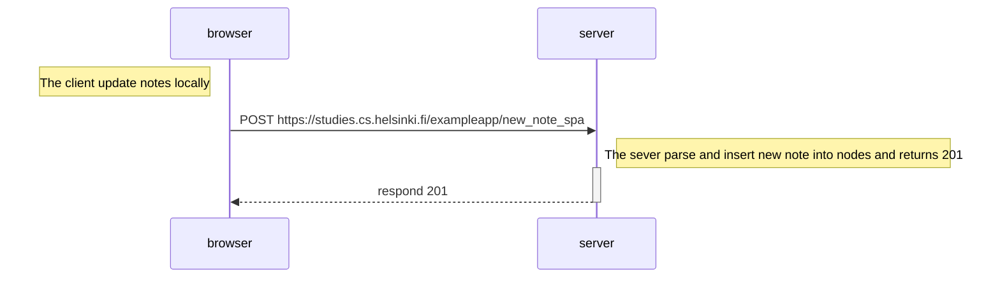

```mermaid
sequenceDiagram
    participant browser
    participant server

    Note left of browser: The client update notes locally
    browser->>server: POST https://studies.cs.helsinki.fi/exampleapp/new_note_spa
    Note right of server: The sever parse and insert new note into nodes and returns 201
    activate server
    server-->>browser: respond 201
    deactivate server
```
